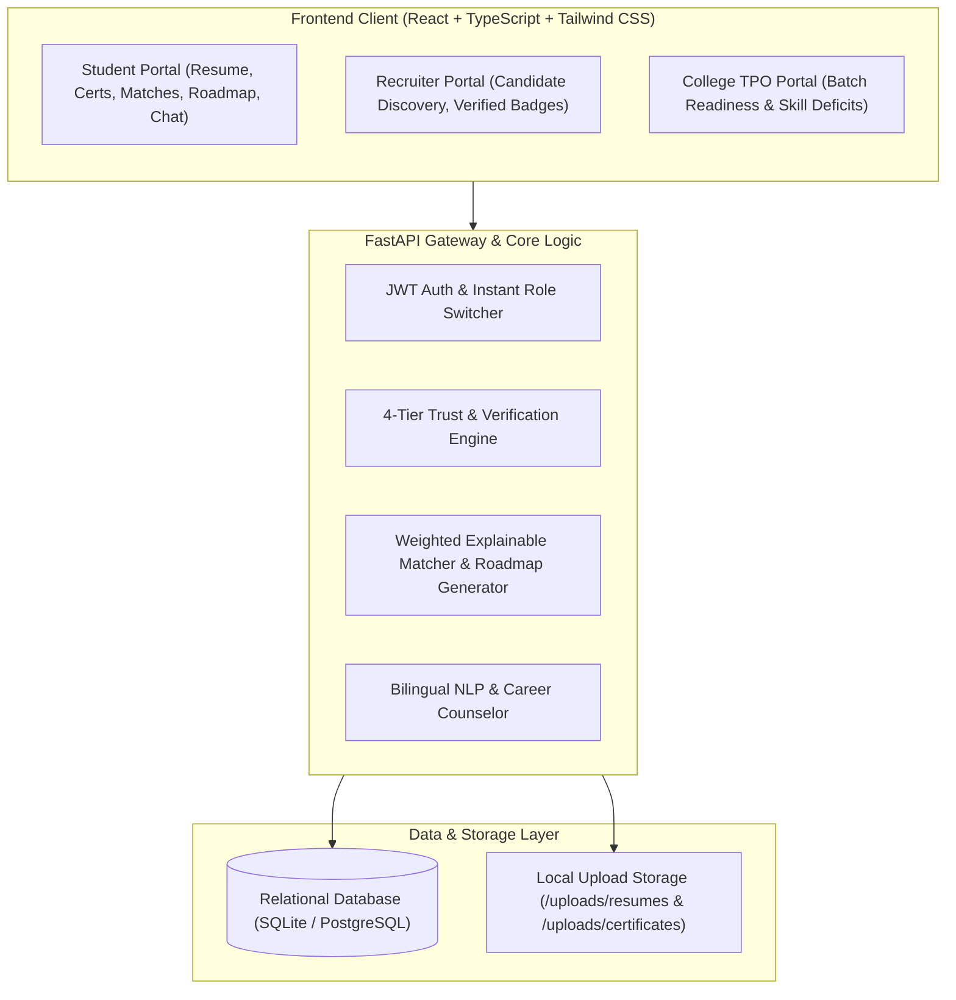

# 🎯 CareerLens: AI-Powered Verified Career & Internship Platform

> **Ending Resume Fraud with 4-Tier Multi-Modal Credential Verification, Explainable Match Scoring, and Bilingual AI Career Guidance.**

[](https://fastapi.tiangolo.com)
[](https://react.dev)
[](https://www.typescriptlang.org)
[](https://tailwindcss.com)
[](https://ai.google.dev)
[]()

---

## 📌 Problem Statement

In campus recruiting and entry-level technical hiring:
1. **Resume Fraud & Exaggeration**: Up to **70% of resumes** contain unverified claims, forged certificates, or exaggerated skills.
2. **Black-Box Match Percentages**: Conventional platforms output an arbitrary percentage score (e.g. *"You are an 85% match"*) without explaining **why** or **what is missing**.
3. **Language Barriers**: Talented students from diverse non-metro backgrounds struggle with English-only career advisory tools.
4. **Lack of Institutional Visibility**: College Training & Placement Offices (TPOs) lack real-time visibility into batch skill deficits and placement readiness benchmarks.

---

## 💡 Solution: What is CareerLens?

CareerLens is a verifiable talent platform connecting students, companies, and universities with an impenetrable trust layer:

- 🛡️ **4-Tier Credential Verification Engine**: SHA-256 duplicate hashing, QR authority lookup, OCR name consistency matching, and digital image Error Level Analysis (ELA) + PDF forensic tamper detection.
- 🎯 **Explainable Match Scoring**: Mathematical decomposition:
  $$\text{Match Score} = (0.45 \times \text{Verified Skills}) + (0.20 \times \text{Resume Skills}) + (0.15 \times \text{Academic Fit}) + (0.20 \times \text{Credential Depth})$$
- 🗺️ **4-Week Actionable Skill-Gap Roadmaps**: Automatically curates weekly sprints with hands-on projects to elevate student match scores to 90%+.
- 🤖 **Bilingual AI Career Counselor**: Native support for **English**, **Hindi (हिंदी)**, and colloquial **Hinglish** (*"Mera match score 95% kaise hoga?"*), grounded directly in the student's verified profile data.
- 💼 **Company Recruiter Discovery Portal**: Zero-fraud hiring portal allowing recruiters to filter exclusively by Gold/Silver verified badges and inspect forensic audit logs.
- 🏛️ **College / TPO Analytics Portal**: Live cohort analytics, batch placement readiness index (e.g., 78.2% ready), department benchmarks, and critical batch skill deficit reports (e.g., 74% students missing Redis caching).

---

## 🏗️ System Architecture



---

## 🛡️ 4-Tier Verification Engine: How It Works

| Tier | Protocol | Detection Mechanism |
| :--- | :--- | :--- |
| **Tier 1** | **SHA-256 Hash Integrity** | Computes unique cryptographic digest. Flags duplicate certificate files registered across different student profiles. |
| **Tier 2** | **QR Authority Scanner** | Decodes embedded 2D QR codes using computer vision and verifies destination URI against recognized certificate authorities (AWS, Coursera, NPTEL, edX). |
| **Tier 3** | **OCR Entity & Name Matching** | Extracts recipient name, issuer, issue date, and credential ID. Executes fuzzy token distance against student registered name to prevent stolen credentials. |
| **Tier 4** | **Forensic Tamper Detection** | Runs **Error Level Analysis (ELA)** on image pixels to detect compression discontinuities when names or dates are pasted over existing certs. Inspects PDF authoring metadata for suspicious editing tools (Canva, Photoshop). |

---

## 🚀 Quickstart Guide

### Prerequisites
- Python 3.10+
- Node.js 18+ and npm
- Git

### 1. Clone the Repository
```bash
git clone https://github.com/your-username/CareerLens.git
cd CareerLens
```

### 2. Backend Setup
```bash
cd backend
python3 -m venv venv
source venv/bin/activate  # On Windows: venv\Scripts\activate
pip install -r requirements.txt

# Run Unit & Integration Tests (9 passed)
pytest

# Start Backend Server
uvicorn app.main:app --reload --port 8000
```
Backend API will be running at: `http://localhost:8000`  
Swagger API Docs available at: `http://localhost:8000/docs`

### 3. Frontend Setup
In a new terminal:
```bash
cd frontend
npm install
npm run dev
```
Frontend will be running at: `http://localhost:3000`

---

## 🧪 5-Minute Hackathon Demo Script (For Judges)

1. **Open Platform (`http://localhost:3000`)**:
   - Show the problem statement and the 4-tier verification protocol overview.
2. **Student Dashboard (Aarav Sharma)**:
   - View Placement Readiness Gauge (**88.5% - Ready to Place**).
   - Notice verified **AWS Certified Developer (Gold Badge)** and **React Specialization (Gold Badge)**.
3. **Test Certificate Verification (`/student/certificates`)**:
   - Click the green button **"⚡ Test 1: Valid AWS (Gold Badge)"** $\rightarrow$ Watch the 4-tier inspection run in 1.5 seconds $\rightarrow$ **GOLD BADGE** issued and Cloud skills auto-verified.
   - Click the red button **"🚨 Test 2: Tampered Cert (Flagged)"** $\rightarrow$ Watch Error Level Analysis catch the alteration $\rightarrow$ **FLAGGED** status with detailed tamper report.
4. **Inspect Forensic Audit**:
   - Click **"Forensic Audit"** to view SHA-256 fingerprint, QR authority payload, OCR recipient cross-validation, and forensic ELA report.
5. **Explainable Match Scoring (`/student/jobs`)**:
   - Open **Cloud Software Engineer Intern** at TechCorp (**86% Match**).
   - Click **"Explain Score & Gap"** $\rightarrow$ Show the mathematical breakdown (45% verified skills, 20% resume skills, 15% academic fit, 20% depth).
   - Show green verified skill pills and red missing skill pills (Redis, Docker).
6. **Generate 4-Week Roadmap**:
   - Click **"Bridge Gap: 4-Week Roadmap"** $\rightarrow$ Show personalized 4-week sprint projecting match score from 76% to 96%.
7. **Bilingual AI Counselor (`/student/chat`)**:
   - Ask in Hinglish: `Mera match score 95% kaise hoga?`
   - Ask in Hindi: `रिज्यूमे में कौन सी स्किल्स जोड़नी चाहिए?`
   - Watch CareerLens AI answer in the user's native tongue while grounded in their verified AWS badge!
8. **Switch to Recruiter View**:
   - In navbar, click Demo Switcher $\rightarrow$ **Recruiter View (Sneha Rao @ TechCorp)**.
   - Filter candidates by **"🥇 GOLD ONLY"** $\rightarrow$ See verified candidates rise to the top.
   - Click **"Credibility Card"** to inspect proof before 1-click interviewing.
9. **Switch to College TPO View**:
   - In navbar, switch to **College TPO View (Dr. Rajiv Kapoor @ IIIT)**.
   - View cohort placement readiness (78.2%), fraud prevention rate (99.4%), and batch skill deficits.

---

## 📁 Repository Structure

```
CareerLens/
├── backend/
│   ├── app/
│   │   ├── api/v1/          # Modular REST endpoints (auth, certs, jobs, matching, chat)
│   │   ├── core/            # Config, security (JWT/bcrypt), database engine
│   │   ├── models/          # SQLAlchemy relational models
│   │   ├── schemas/         # Pydantic validation schemas
│   │   ├── services/        # 4-tier verifier, ELA tamper detector, matcher, Gemini AI
│   │   ├── seed/            # Realistic demo database seeder
│   │   └── main.py          # FastAPI application entrypoint
│   ├── tests/               # Pytest suite (Auth, Matching, Verification)
│   └── requirements.txt
├── frontend/
│   ├── src/
│   │   ├── components/      # TrustBadge, VerificationModal, ExplainableMatchModal, RoadmapModal
│   │   ├── pages/           # Student, Recruiter, College, Landing
│   │   ├── lib/             # API client, TypeScript types, AuthContext
│   │   └── App.tsx          # Client-side routing
│   └── package.json
├── docs/                    # Architecture, API Docs, and Verification Engine deep-dives
└── docker-compose.yml
```

---

## 👥 Authors
Built with ❤️ for Hackathon 2026.
